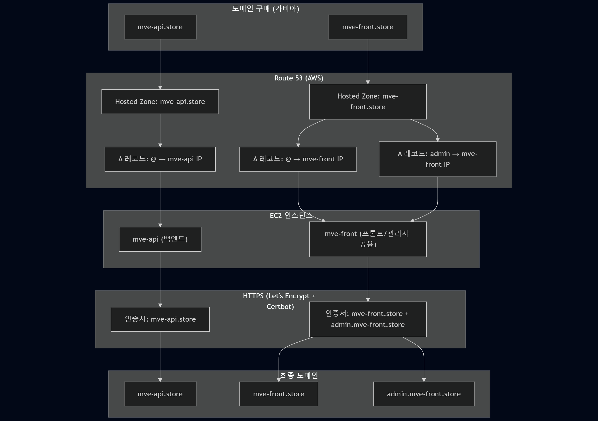

## 1. 도입

### 1.1 HTTPS란 무엇인가?

웹 브라우저 주소창을 보면 어떤 사이트는 `http://`로 시작하고, 어떤 사이트는 `https://`로 시작합니다.  
이 두 가지의 차이는 단순한 철자 문제가 아니라, **보안 여부**에 대한 중요한 차이입니다.

HTTPS(HyperText Transfer Protocol Secure)는 기존 HTTP에 **보안 계층(SSL/TLS)** 을 덧붙인 통신 방식입니다.  
HTTP는 평문으로 데이터를 주고받기 때문에 제3자가 중간에서 정보를 쉽게 훔쳐볼 수 있지만,  
HTTPS는 암호화를 적용하기 때문에 훔쳐보더라도 내용을 알 수 없습니다.

즉, HTTPS는 웹사이트에 접속할 때 **내가 누구에게 정보를 보내는지 확실히 알고**,  
**그 정보가 중간에서 노출되지 않도록 안전하게 전달한다**는 신뢰를 보장하는 구조입니다.

---

### 1.2 HTTPS를 사용하는 이유

HTTPS를 사용하는 이유는 단순히 “보안” 때문만은 아닙니다.  
**현대 웹 서비스에서는 HTTPS가 선택이 아니라 필수**입니다.  
그 이유를 단계적으로 살펴보면 다음과 같습니다.

- **1) 사용자 신뢰 확보**
  브라우저는 HTTPS가 없는 사이트에 “주의 요함” 또는 “안전하지 않음” 경고를 띄웁니다.  
  이 메시지만으로도 사용자는 그 사이트를 벗어나게 됩니다.

- **2) 개인정보 보호**
  로그인, 회원가입, 지갑 주소, 간편 비밀번호 등 민감한 정보를 주고받는 웹페이지에서는 HTTPS가 없으면 모든 정보가 평문으로 노출됩니다. 이는 곧 해킹의 표적이 됩니다.

- **3) 검색엔진 가산점(SEO)**
  구글을 포함한 검색엔진은 HTTPS가 적용된 사이트에 더 높은 신뢰 점수를 부여합니다. 즉, 노출 순위에도 영향을 줍니다.

- **4) Web3 도구 및 지갑 연동 호환성**
  Metamask, WalletConnect, Kaikas 같은 지갑 확장 프로그램은 HTTPS가 아닌 환경에서는 작동하지 않습니다.  
  이는 곧 블록체인 기반 프로젝트에서는 HTTPS 없이는 개발 자체가 어려워진다는 뜻입니다.

정리하면, HTTPS는 “보안을 위해 있는 것”이 아니라, **웹 서비스의 기본 전제 조건**이라고 할 수 있습니다.

---

### 1.3 전체 구조 요약 및 서브도메인 설계 개요

이번 프로젝트는 단순한 정적 페이지 하나만 띄우는 것이 아닙니다.  
사용자와 관리자가 구분되어 있으며, 백엔드와 프론트가 나뉘어져 있습니다.  
따라서 다음과 같은 **구조적 분리와 도메인 설계**가 필요합니다.

---

### 전체 구성 개요

| 구성요소    | 설명                                         |
| ----------- | -------------------------------------------- |
| `mve-api`   | REST API 서버 (백엔드)                       |
| `mve-front` | 사용자 + 관리자 화면을 모두 담는 프론트 서버 |

- 실제로는 `mve-front`라는 하나의 Next.js 앱에서,
  사용자와 관리자 화면을 **도메인에 따라 분기**되도록 설계합니다.

---

### 우리가 사용할 도메인 구조

| 도메인                     | 설명                        |
| -------------------------- | --------------------------- |
| `mve-api.store`            | 백엔드 API 서버 도메인      |
| `mve-front.store`          | 일반 사용자용 프론트 도메인 |
| `admin.mve-front.store` ✅ | 관리자 전용 서브도메인      |

> `admin.mve-front.store`는 `mve-front.store`의 **서브도메인**입니다.
> 따라서 도메인 구매는 `mve-api.store`, `mve-front.store` **두 개만** 하면 되고,
> 서브도메인 `admin.mve-front.store`는 **Route 53의 A 레코드**로 구성합니다.

---

### 왜 서브도메인을 사용하는가?

1. **권한과 인터페이스 구분**
   일반 사용자와 관리자는 접근 권한, UI 구성, 동작 방식이 완전히 다릅니다.
   이를 도메인 단위로 분리하면 **접근 제어, 인증 로직, 시각적 인터페이스를 명확히 분리**할 수 있습니다.

   - ex: `https://mve-front.store` → 유저 전용
   - ex: `https://admin.mve-front.store` → 관리자 전용

2. **보안 정책 적용의 유연성**
   서브도메인 단위로 **쿠키 도메인 범위**, **CORS**, **접속 제어 정책** 등을 개별적으로 적용할 수 있습니다.

3. **유지보수 및 인프라 확장 용이성**
   추후 관리자 페이지를 별도로 배포하거나, 권한 기반으로 별도 서버로 옮길 때에도
   서브도메인 단위 분리가 되어 있으면 유연하게 전환할 수 있습니다.

---

### 최종 배포 구조 요약

| 도메인                  | 역할                         | 배포 대상                           |
| ----------------------- | ---------------------------- | ----------------------------------- |
| `mve-api.store`         | 백엔드 API                   | `mve-api` EC2 인스턴스              |
| `mve-front.store`       | 일반 사용자용 프론트         | `mve-front` EC2 인스턴스            |
| `admin.mve-front.store` | 관리자용 프론트 (서브도메인) | 동일한 `mve-front` 인스턴스 내 분기 |

→ 즉,

- **구매 도메인: 2개**
- **Route 53 호스팅 영역: 2개 생성** (`mve-api.store`, `mve-front.store`)
- **DNS A 레코드: 3개 등록** (`@`, `admin`, 각각의 IP 주소로 설정)
- **인스턴스: 2개 (API / FRONT)**
- **HTTPS 인증서: 2개 발급** (Certbot으로 각각 도메인 기준 발급)

## 도식화

---

이제 이 구조를 전제로 도메인 설정과 서버 배포 흐름을 진행합니다.
**→ 다음은 2. 도메인 준비로 넘어갑니다.**
